### tensorflow 通过device来管理CPU和GPU
    
* 单机使用
 
    [image not found...(分布式tensorflow/tf-device.png)]

    123

    

* 多机使用
 
    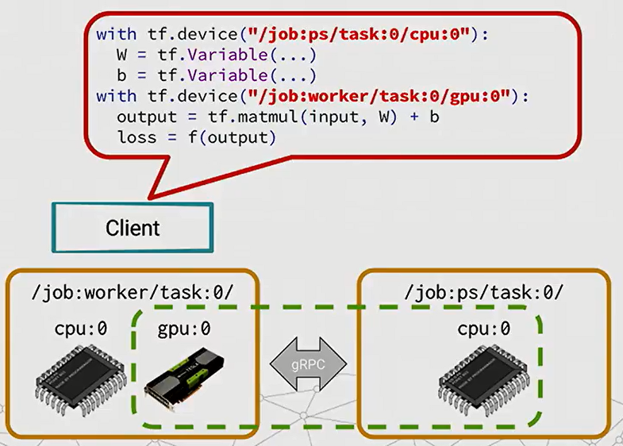

### 分布式架构下的管理方式，通过两个不同职责的进程PS 和 Worker 进行分工计算。
* 
    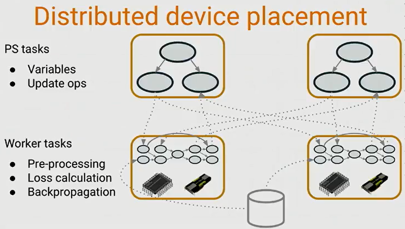
    
    > Parameter Server：PS负责保存和更新所有的模型状态，即参数信息。根据梯度信息更新参数。
    > Worker replicas ：worker主要做计算，处理神经网络中的loss 和梯度

### tensorflow分布下模型复制的方式
* In-graph replication
  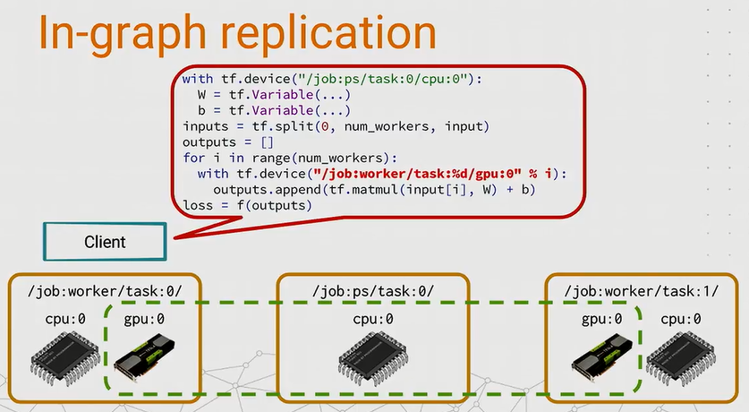

    > 早期常用的一种，图内复制方式. 主要步骤为：
    > 1. 将参数设置在 PS device上，
    > 2. 并将训练数据分成几份，在循环内发送到GPU 设备上（worker）
    > 3. 把各个worker计算的结果收集后，合成最后的loss。
  
    >* 少量数据和节点时使用。

* Between-graph replication
  
  图间复制是每个worker上跑一小部分计算图，参数放在PS上，其他数据则放在本地。中间的PS Task上会共享变量，提供给Worker Task 使用，变量对所有worker task 可见。
  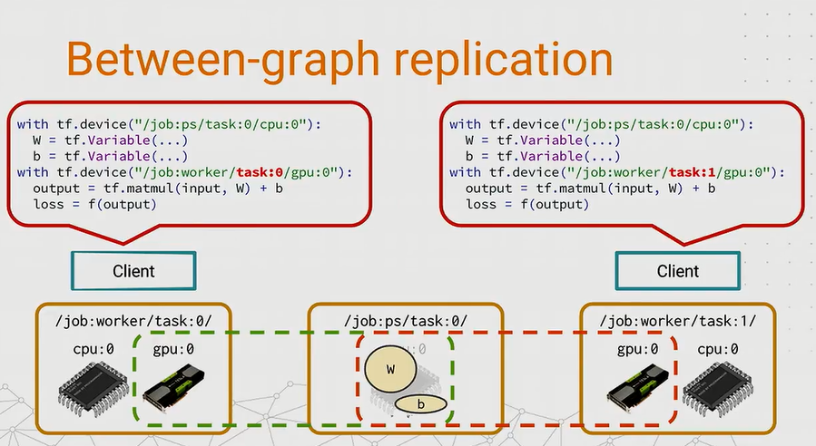
  
  这种变量共享设计就带来另外一个问题：我们如何选择地址来放置我们的变量？因为上一个例子中只有一个PS task,这样把所有的变量用设备字都放置在一个固定设备中固然可行，但有时我们想要实现多于1个的PS task时候怎么办呢？比如我们想要分配变量更新的工作，或者想平衡worker task来取变量时候的网络负载时，很可能就要用到多个PS任务了。接下来就讨论一下变量的放置问题。

* 根据参数放置设备（Device placement for Variables）
  
  使用设备函数，可以不直接指定具体的tf.device设备，tensorflow内置了几个策略函数。
    
    * Round-robin variables 

    最简单的一个方法叫tf_train_replica_device_setter方法，它会循环地分配变量，就像创建PS的时候。这个设备函数的优点是，你可以把整个模型建模代码用这个模块包起来。它只影响变量，把它们放在PS任务中，而其他的工作会自动到worker中执行。

    如下图所示，这个程序会把第一个weight权重变量被放在到PS task0，第一个bias偏置变量被放置到PS task1, 接下来第二个weight被放置到PS task2，最后一个回来放到task0中。
    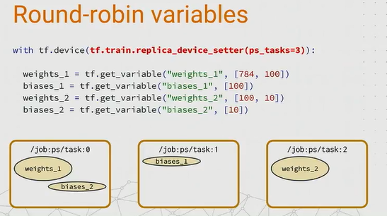

    * Load balancing variables

    有一个简单的贪婪策略叫GreedyLoadBalancingStrategy, 它可以根据参数的内存字节来完成类似在线垃圾收集的工作。根据weight和bias的字节数来放置到内存合适的task中，带来更好的负载平衡。
    
    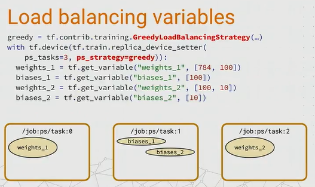
    * Partitioned variables

    以上讨论的都是很小字节的参数，每个PS task都可以单独处理一个变量。但当遇到超大字节，比如可能是几万MB的数据该如何处理？要解决这个问题，提出一个分割变量的方法。假设你用分隔符创建了一个变量，tensorflow会把这个变量分割成3个部分，分发到3个PS task中。
    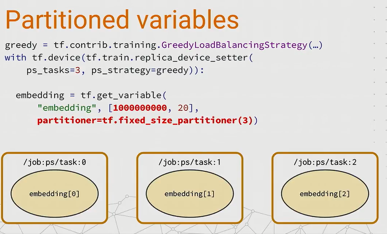

### 如何跑分布式的计算

* tf.Session 只能管理到本地的资源

    完成了资源配置后，我们就要开始继续run一个tensorflow的session了。如果你使用以下的代码来运行一个tensorflow的session, tf.Session只能知道本地机器的资源设备。
    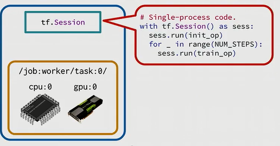

* tf.train.Server 负责多机器之间训练通信

    如何多台机器，tf.session则无能为力，需要通过tf.train.server 建立一个集群，进行训练。
    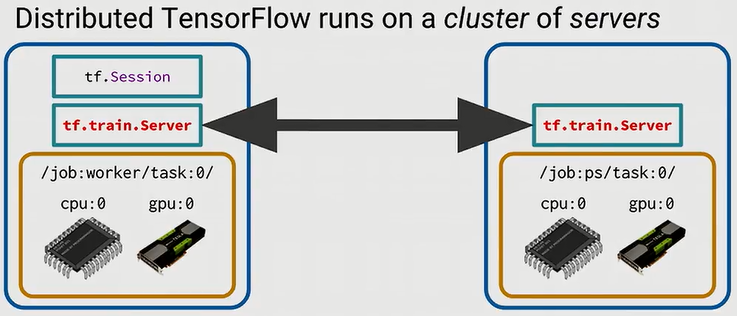

* 通过ClusterSpec方式 实现 PS 和Worker 的代码片段
    * worker snippet
    > 1. 定义一个ClusterSpec, 用于定义一个集群中的PS， worker分别对应的是哪些机器。这样手动输入很容易出错，所以我们还可以用kubernetes或Mesos这些集群管理框架来管理。后面会出一篇tensorflow on k8s的文章；
    > 2. 然后创建一个tensorflow Server，它代表集群里的一个特定任务
    > 3. 最后创建一个Session，一个session可以在集群中的任何一个设备上运行代码。

    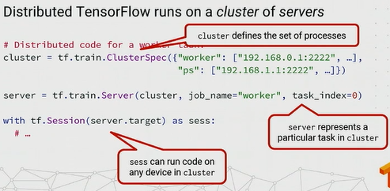
    * ps snippet
    > 1. 定义一个ClusterSpec；
    > 2. 然后创建一个tensorflow Server，它代表集群里的一个特定任务
    > 3. 最后server.join()

    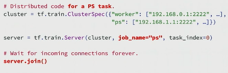

